


 

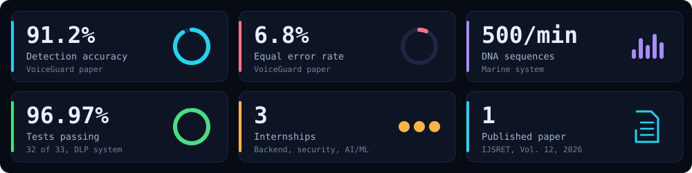


Final-year CSE student at KNCET, Tiruchirappalli. I build Django and Flask backends with token-based access control, and the ML systems behind them: voice-deepfake detection, medical imaging, satellite flood mapping. I also try to break what I build, with an OWASP Top 10 scanner and a data-loss-prevention tool.




<table>
<tr>
<td width="50%"><a href="https://github.com/Akhil-0911/Flood_Detection"></a></td>
<td width="50%"></td>
</tr>
<tr>
<td width="50%"><a href="https://github.com/Akhil-0911/Marine"></a></td>
<td width="50%"><a href="https://github.com/Akhil-0911/PADCOM_V3"></a></td>
</tr>
<tr>
<td width="50%"><a href="https://github.com/Akhil-0911/Vuln_Scanner"></a></td>
<td width="50%"><a href="https://github.com/Akhil-0911/SecureVault"></a></td>
</tr>
<tr>
<td width="50%"><a href="https://github.com/Akhil-0911/Emotion-bot"></a></td>
<td width="50%"><a href="https://doi.org/10.5281/zenodo.19480877"></a></td>
</tr>
<tr>
<td width="50%"></td>
<td width="50%"></td>
</tr>
</table>

Click a card to open the repo or paper. More in <a href="https://github.com/Akhil-0911?tab=repositories">all repositories</a>.


Looking for a backend or applied ML role starting 2027 (on-site, hybrid or remote). The fastest way to reach me is [email](mailto:akhil.kncet@gmail.com).

